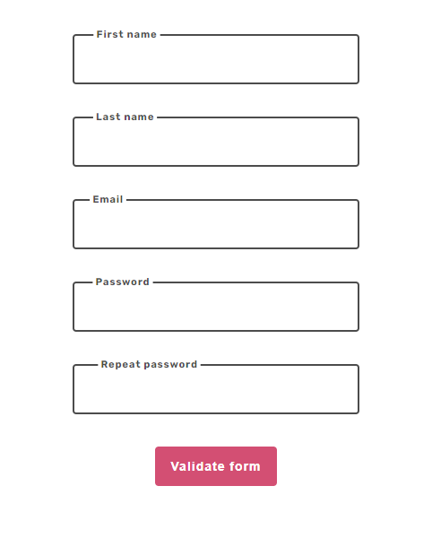
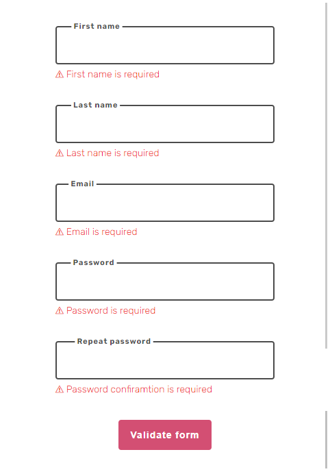

# React-hook-form practical usage

Created form validation to learn react-hook-form with YUP.

## TECH

- REACT
- CSS
- REACT-HOOK-FORM
- YUP
- PropTypes

### Preview

Empty form

Form with validation

